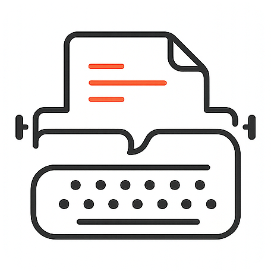

<p align="center">
  
</p>

<h1 align="center">享寫</h1>

<p align="center">
  <em>AI 原生的沉浸式中文写作平台 · 不负每一份灵感</em>
</p>

<p align="center">
  <a href="https://butea-post.vercel.app">
    
  </a>
</p>

<p align="center">
  <a href="https://butea-post.vercel.app">在线试用</a> ·
  <a href="#开篇">开篇</a> ·
  <a href="#技术实现">技术实现</a> ·
  <a href="#quickstart">本地运行</a> ·
  <a href="CONTRIBUTING.md">贡献</a> ·
  <a href="#license">License</a>
</p>

---

## 开篇

享写，是一个 AI 原生的沉浸式写作平台。

**思考 — 写作 — 发布**

这就是每个作者应该关心，而且唯一应该关心的全部。而整个过程不应该被 Word、浏览器、搜索引擎、AI 对话这些反复横跳的切换所打断。"享写"提供了这样一种可能，作者从思考选题开始，就不需要离开这个平台，直到自动获得多个平台的适配内容。

为了实现这个"简单"的目标，我访问了多位不同领域的创作者，有非虚构文学作者、商业文案写手、自媒体作者和社交媒体深度用户。针对他们真实工作流的蒸馏与优化，是"享写"这个产品的基石。它力求为创作者提供了一个从选题、大纲、草稿到细节优化，全过程的 AI 深度支持的同时，保留了作者对内容的绝对控制。

---

## 技术实现

> 围绕「思考 → 写作 → 发布」这条主线，享寫把每个环节里作者真正需要的能力折叠进一个单页面 App。没有服务器，没有账号，所有内容、API key、配置都在你自己的浏览器里。

### 总览

- **纯前端 + BYOK** —— Next.js 16 App Router 部署在 Vercel，浏览器即运行时
- **AI 直连流式转发** —— `/api/llm` 与 `/api/image` 只是 Edge runtime 上的代理管道，**不缓存、不解析、不存任何内容**
- **数据本地化** —— 文档正文、媒体二进制、应用配置、自定义主题，全部在 IndexedDB / localStorage，不同域名完全隔离
- **技术栈** —— Next.js 16 · TypeScript (strict) · TipTap 3 · Zustand · IndexedDB · Tailwind CSS v4 · Radix UI · unified / remark / rehype · juice

### 思考阶段 —— AI 写作助手

把通用 AI 对话内嵌进侧边栏，但形态比 ChatGPT 更贴近写作：

- **双模式 Tab，独立保留对话历史**
  - **写作引导**：agent 系统提示带你从「选题 → 大纲 → 草稿」一步步推进，每一步识别成 step pill（📝 选题方向 / 📋 大纲 / ✍️ 草稿），给到针对性按钮（如「应用为本篇大纲」会自动跳到本篇面板）
  - **自由对话**：开放对话 + Skill 库弹出，10 个预制写作 prompt：选题脑暴 / 拆解爆款 / PAS·SCQA 大纲 / 段落扩写 / 切换文风 / 加钩子 / 标题魔咒 / 结尾 CTA / 合规预检 / 大纲扩写为正文
- **写作偏好注入** —— 你在设置里写的「赛道、读者画像、风格禁忌」会自动拼进每一次 AI 调用的 system prompt，无需重复说明
- **流式 + 可中断** —— 所有 AI 输出走 SSE 流，红色停止按钮随时打断
- **多 provider** —— OpenAI · Anthropic · DeepSeek · Gemini · fal.ai · 任意 OpenAI 兼容端点；**文字和图片可独立配置**

### 写作阶段 —— 沉浸式编辑器 + 本篇侧边栏

**编辑器**（TipTap 3 单一所见即所得 + 源码模式 toggle）：

- Markdown 快捷键即写即转（`# `→标题、`> `→引用、`* `→列表、`---`→分割线）
- **17 套排版主题**（配色 × 风格双轴），自定义主题编辑器覆盖配色、字体、字号、行高、段距、标题装饰、背景纹理，逐文档独立
- **Admonition 卡片**（6 种，兼容 Obsidian Callout 语法）、**半高荧光笔**（7 色）、**代码块**（14 种语言 + 一键复制 + 语言标签）、**链接卡片**（自动抓取标题 / 描述 / 缩略图）、**图片**（拖拽 / 缩放 / 4 种对齐 / 全宽 / 图注）、**视频嵌入**（YouTube / Bilibili 等）
- **工具栏 AI 菜单** —— 选中文字一键扩写 / 改写 / 精炼 / 加钩子 / 全文润色，结果在 dialog 里流式预览，确认后替换选区

**本篇侧边栏**（针对当前文档的结构化操作）：

- **大纲 tab，双向联动**：自动从 H1/H2/H3 生成；点跳转、双击改名、上/下移整节（同级 sibling 内换位）、删除整节（连同子节）、底部一键添加新小节。所有变更回写 Markdown，编辑器实时反映
- **AI 工具 tab**：Skill 库的"工具化"版本，结果直接在面板内流式渲染。按 skill 性质给四种应用方式：**追加到末尾**（CTA）/ **替换正文**（大纲、整篇生成）/ **插入光标处**（段落扩写、切换文风、加钩子）/ **仅复制**（合规预检、标题候选）
- 文档标题（H1 自动同步）、标签、保存状态、快照按钮聚拢在面板 header

**文档与资产**：

- **文档库** —— IndexedDB 存储，30 天回收站，标签搜索，导入 `.md` / `.txt` / `.html` / `.docx`
- **资产** —— 媒体二进制存浏览器 IDB，URL 协议 `butea-media://<id>`，拖入编辑器即用，发布前可批量推图床
- **Obsidian** —— 通过 File System Access API 直接打开本地 vault，只读浏览 + 一键导入，**无需安装任何插件**

### 发布阶段 —— 多平台原生化

每个平台都有自己的"母语"——公众号要长读、小红书要图卡、X 要 Thread、微博要钩子、朋友圈要摘要。同一篇文章贴到不同平台，要么被字数硬截，要么被算法埋掉。享寫不做简单的格式复制，而是按平台特性把内容**重新表达**：

| 平台 | 形态 | AI 改写 |
|------|------|--------|
| **公众号** | 内联样式 HTML，复制富文本即贴 | 否 |
| **博客 (通用 HTML)** | 结构化 HTML | 否 |
| **Astro 博客** | 直接 commit 到你的 GitHub repo | 否 |
| **X / Long-form** | Premium 25k 字长文 | 否 |
| **小红书** | 标题 + 图卡 + 正文 + hashtag | 是 |
| **X / Thread** | 自动拆 ≤280 字推文串 | 是 |
| **微博** | 140 字短文 + 话题 | 是 |
| **朋友圈** | 200 字摘要 + 链接预览 | 是 |

- **Adapter 模型** —— 加一个新平台 = 写一个 ~30 行的 `Adapter` 接口实现，在注册表加一行。这是开源贡献最容易上手的入口，详见 [CONTRIBUTING.md](CONTRIBUTING.md)
- **图床** —— 发布前批量上传到 Cloudflare R2 / Imgur / GitHub，Markdown 里的 `butea-media://` 本地引用自动替换为公网 URL
- **Astro 直推** —— 配置好 GitHub repo + token，把当前文档以 `.md` 形式直接 commit 到你的 Astro 站点的 `src/content/` 目录

### 架构

```
┌────────────────────────────────────────────────────┐
│        Markdown 草稿（store + IndexedDB）           │
└────────────────────────┬───────────────────────────┘
                         │
              ┌──────────▼───────────┐
              │  TipTap 3 Editor     │  沉浸式所见即所得
              │  (WYSIWYG ⇄ Markdown)│  + 源码模式 toggle
              └──────────┬───────────┘
                         │
       ┌─────────────────┼─────────────────┐
       │                 │                 │
┌──────▼─────┐   ┌───────▼──────┐   ┌──────▼──────┐
│ AI 写作助手 │   │   本篇侧栏    │   │ Platform    │
│  agent +   │   │  大纲 + 工具  │   │ Adapter ×N  │
│  skills    │   │  双向联动     │   │  ~30 行/平台 │
└──────┬─────┘   └──────────────┘   └──────┬──────┘
       │                                    │
   ┌───▼────┐                       ┌───────▼───────┐
   │ Edge   │                       │ AdapterOutput │
   │ /api/  │ ───→ 你的 LLM         │ html │ thread │
   │ llm    │      provider         │ cards│summary │
   └────────┘                       └───────────────┘
```

- 加新平台 = `lib/adapters/` 加一个文件 + 在 `lib/adapters/index.ts` 注册
- 加新 LLM provider = 走 OpenAI 兼容端点（`providerId: "custom"`）零代码
- 加新主题 = `lib/themes/themes.ts` 加一个对象，主题编辑器里实时预览

### Quickstart

需要 **Node 20+**：

```bash
git clone https://github.com/leeyoung1982/butea_post.git
cd butea_post
npm install
npm run dev
# → http://localhost:3000
```

首次打开后，左下角 ⚙ 设置 → 填入 LLM API key（推荐 DeepSeek 性价比最高，也支持 OpenAI / Anthropic / Gemini / 自定义端点）。

### 配置

| 在哪里配 | 配什么 | 存哪里 |
|---------|--------|--------|
| 设置 → LLM | 文字 AI 的 provider + API key + 模型 + endpoint | localStorage |
| 设置 → 图片 provider | 图片 AI 的 provider + API key（可与文字 provider 不同） | localStorage |
| 设置 → 写作偏好 | 赛道、读者画像、风格禁忌（注入所有 AI 调用） | localStorage |
| 设置 → 图床 | Cloudflare R2 / Imgur / GitHub PAT | localStorage |
| 设置 → Astro 博客 | GitHub repo + token + 目标目录 | localStorage |

> 💡 **没有 `.env` 文件**。所有配置都在浏览器，不会泄漏到 git，不同域名（localhost vs Vercel）的数据完全隔离。

### 隐私与数据所有权

- 草稿、媒体、配置、API key —— 全部在**你的**浏览器
- `/api/llm`、`/api/image` 是 Edge 上的流式转发管道，**不缓存任何内容**
- 没有账号系统、没有遥测、没有埋点
- 一键导出全部 Markdown 备份（文档库 → 导出）

---

## 收尾

"享写"是紫矿 AI 工作室（Butea AI Studio）的第一个 vibe coding base 的产品，希望它能得到技术社区的朋友们的 issues，从而能让"享写"帮助优秀的创作者们把宝贵的时间留给真正重要的事。

---

## License

[MIT](LICENSE) — 拿去用、改、卖、商用都行，署名一下就好，无需通知。

---

<p align="center">
  <sub>为中文创作者而生。<br/>
  <em>不负每一份灵感。</em></sub>
</p>
